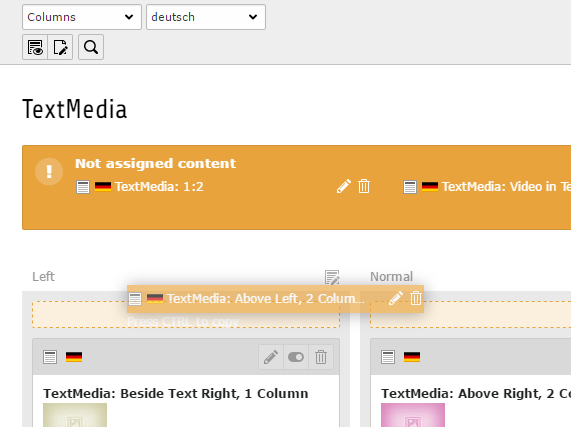

# Documentation

This extension shows an alert with not assigned content elements in the columns view of the page module.

*This is usefull for editors when they change the backend layout of a page and one or more colPos do not exist in the new backend layout.*

Not assigned content elements can be assigned by drag'n'drop to a column or directly edited or deleted.

## Installation

Install extension as zip or by composer.

## Integration

You can change the behavior of the extension over some extension settings.

## FAQ

<dl>
<dt>Why you don't render content elements with the regular preview</dt>
<dd>Unfortunately TYPO3 doesn't offer an usefull API to render single content elements in the backend.</dd>
<dt>Why you reload the page after drop a not assigned content element.</dt>
<dd>This is the simplest way in order to render the preview.</dd>
</dl>

## Contributing

Bug reports and pull request are welcome through [GitHub](https://github.com/r3h6/TYPO3.EXT.ghost_content).

### Pull request

Pull request to the master branch will be ignored. Please use develop branch.